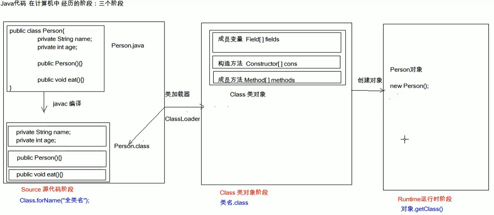

#基础强化笔记
###一. 单元测试
* 测试分类
  1. 黑盒测试：不需要写代码, 给输入值, 看程序能否输出期望值
  2. 白盒测试: 需要写代码, 关注程序具体的执行流程  
* Junit使用(白盒测试)
  1. 定义一个测试类(测试用例类)
     + 测试类名: 被测试的类名Test
    
  2. 定义测试方法(可以独立运行)
     + 测试方法名: test测试方法名
     + 返回值: void
     + 参数列表: 空参
    
  3. 导入Junit的依赖, 并给方法加注解@Test
    
  4. 初始化方法注解 @Before(用于资源申请, 所有测试方法在执行之前都会执行该方法)
    
  5. 释放资源方法注解 @After(在所有测试方法执行完之后, 都会自动执行该方法)
    
###二. 反射(将类的各个组成部分封装为其他对象, 这就是反射机制)
* 优点
  1. 可以在程序运行过程中, 操作这些对象
  2. 可以解耦, 提高程序的可扩展性
  
* 获取Class对象的方式
  1. Class.forName("全类名"): 将字节码文件加载进内存, 返回Class对象   **[多用于配置文件]**
  2. 类名.class: 通过类名的属性class获取  **[多用于参数传递]**
  3. 对象.getClass(): getClass()方法继承自Object  **[用于对象获取字节码文件的情况]**

* 图解



* 小结: 同一个字节码文件在一次程序运行过程中, 只会被加载一次, 不论通过哪一种方式获取的
   Class对象都是同一个
  
###三. 自定义注解
* 格式  
  + 元注解(用于描述注解的注解)
    - @Target: 描述注解能够作用的位置
    - @Retention: 描述注解被保留的阶段  
        @Retention(RetentionPolicy.RUNTIME): 当前被描述的注解, 会保留到class字节码文件中, 并被JVM读取到
    - @Documented: 描述注解是否被抽取到api文档中
    - @Inherited: 描述注解是否被子类继承

  + public @interface 注解名称{}
  
* 本质  
  注解本质上就是一个接口, 该接口默认继承Annotation接口
  
* 属性(注解中的抽象方法)
  + 返回值类型只能是:
    - 基本数据类型
    - String
    - 枚举
    - 注解
    - 以上类型的数组  
    
  + 注解中如果定义了属性, 在使用时就要给注解赋值(有default值的可以不赋值), 多个属性值用逗号隔开
    - 如果只有一个属性需要赋值, 并且属性名称为value, 则value可以省略, 直接给值
    - 属性数组赋值时, 值使用{}包裹, 如果数组中只有一个值, 则{}可以省略
* 示例

```java
import java.lang.annotation.Retention;
import java.lang.annotation.RetentionPolicy;

//自定义一个注解
@Retention(RetentionPolicy.RUNTIME)
public @interface MyAnnotation {
  int age();

  String name() default "张三";
}


//在其他地方使用这个注解
@MyAnnotation(age = 1)
public class MyAnnotationTest {

}
```
  

